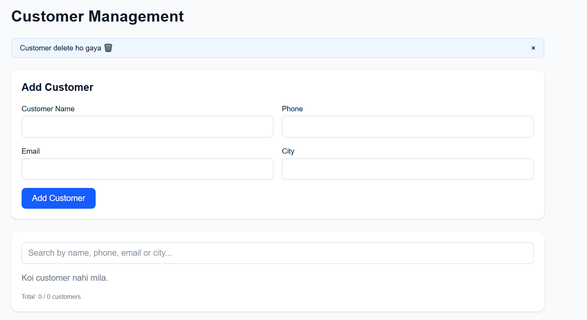
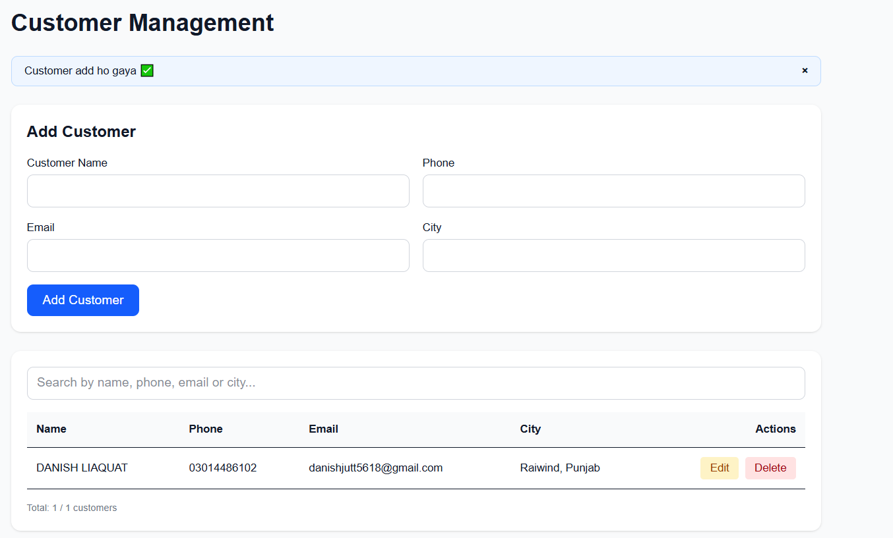
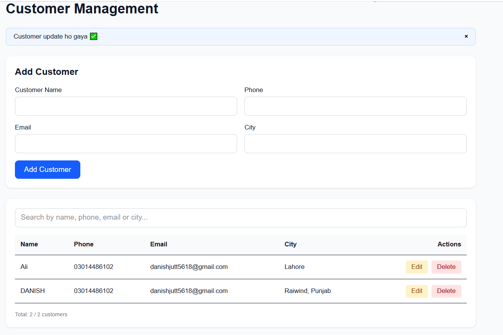
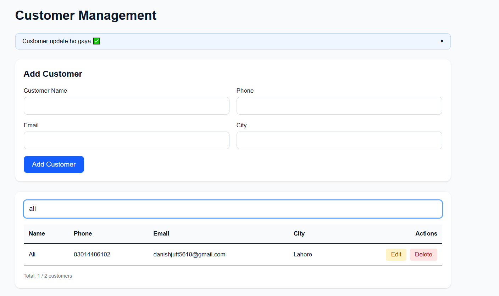

# Mini Customer Management App

A simple and responsive Customer Management App built as a Day 1 practical task for the MERN / Web Development internship.

The application allows users to add, view, edit, delete, and search customer records using a clean and easy-to-use interface.

## Project Overview

This project demonstrates basic CRUD (Create, Read, Update, Delete) operations using Next.js, TypeScript, API routes, and Supabase.

The main goal was to build a functional customer management system with basic form validation and database integration.

## Tech Stack

- Next.js 16
- TypeScript
- React
- Tailwind CSS
- Supabase
- Supabase PostgreSQL Database
- REST API Routes
- Git & GitHub

## Features

- Add new customers
- View all customers
- Edit existing customers
- Delete customers
- Search customers
- Basic form validation
- Responsive user interface
- Supabase database integration
- REST API integration
- Success and error feedback

## Customer Fields

Each customer record contains:

- Customer Name
- Phone
- Email
- City
- Created At

## CRUD Operations

### Create

Users can add a new customer by entering their name, phone number, email, and city.

### Read

All saved customers are retrieved from the Supabase database and displayed in the customer table.

### Update

Users can edit an existing customer's information and save the updated record.

### Delete

Users can remove a customer from the database using the Delete action.

### Search

Users can search customer records by entering a name, phone number, email, or city.

## Database Structure

The application uses a Supabase PostgreSQL table named `customers`.

```sql
create table public.customers (
  id bigint generated by default as identity primary key,
  name text not null,
  phone text not null,
  email text not null,
  city text not null,
  created_at timestamp with time zone default now()
);
Database Columns
Column	Type	Description
id	bigint	Unique customer ID
name	text	Customer name
phone	text	Customer phone number
email	text	Customer email address
city	text	Customer city
created_at	timestamp	Record creation time
API Endpoints

The application uses a Next.js API route:

/api/customers
GET

Retrieves all customers.

GET /api/customers
POST

Creates a new customer.

POST /api/customers
PUT

Updates an existing customer.

PUT /api/customers
DELETE

Deletes a customer.

DELETE /api/customers
Project Structure
customer-app/
│
├── app/
│   ├── api/
│   │   └── customers/
│   │       └── route.ts
│   │
│   ├── page.tsx
│   ├── layout.tsx
│   └── globals.css
│
├── public/
│
├── .env.local
├── .gitignore
├── next.config.ts
├── package.json
├── package-lock.json
└── README.md
Environment Variables

Create a .env.local file in the project root:

NEXT_PUBLIC_SUPABASE_URL=your_supabase_project_url
NEXT_PUBLIC_SUPABASE_PUBLISHABLE_KEY=your_supabase_publishable_key

Do not upload .env.local or any API keys to GitHub.

How to Run Locally
1. Clone the repository
git clone YOUR_GITHUB_REPOSITORY_URL
2. Open the project
cd customer-app
3. Install dependencies
npm install
4. Configure environment variables

Create .env.local and add your Supabase project URL and publishable key.

5. Start the development server
npm run dev
6. Open the application
http://localhost:3000
Validation

The application includes basic validation for:

Required customer name
Valid phone number
Valid email address
Required city
What I Learned

During this project, I learned and practiced:

Building CRUD functionality with Next.js
Creating API routes in Next.js
Connecting a Next.js application with Supabase
Working with PostgreSQL tables
Using Supabase Row Level Security and permissions
Sending GET, POST, PUT, and DELETE requests
Managing React state and form data
Implementing client-side search
Handling API errors
Using environment variables securely
Using Git and GitHub for project version control
Challenges Faced
Supabase Permissions

Initially, the application returned a permission error when trying to access the customers table.

The issue was related to database permissions and Row Level Security policies.

I resolved the issue by configuring the required table privileges and RLS policies for the application.

Environment Variables

I also verified that the Supabase environment variables were correctly configured in .env.local and available to the Next.js server.

Screenshots

Screenshots of the application will be added here.

Customer Management Dashboard



Add Customer



Edit Customer




Search Customer



Future Improvements

Possible future improvements include:

User authentication
Role-based access
Customer profile pages
Pagination
Advanced filtering
Better error handling
Deployment with Vercel
Improved database security
Customer export functionality
Internship Task

This project was developed as part of the Day 1 practical task for the Web Development / MERN track internship.

The project focuses on understanding CRUD operations, database integration, API development, and basic frontend functionality.

Author

Danish Ali